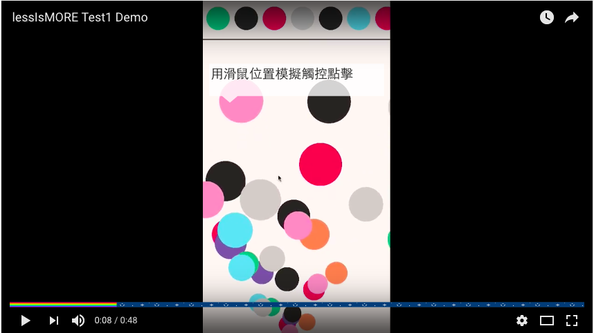

# less is MORE?

## 關於

這是大二在修「手機遊戲設計」時發想的概念性作品，是關於球球的各種玩法。年代有些久遠僅供參考，還有影片可以 Demo 哦！雖然到最後我們的 Project 改成寫 [Flying-Wings](https://github.com/neson/Flying-Wings)，不過這個專案對我來說還是挺重要的，畢竟是我滿滿的惡搞啊（？），

本 Repo 還附上了另外兩份當時的 Design Document，兩次 Check point 各交了一次，若不嫌棄可以看看笑笑 XD。

* [Design Document](./DesignDocument.md)
* [Design Document Final](./FinalProjectDesignDocument.md)

## Tools

* Unity 3D
